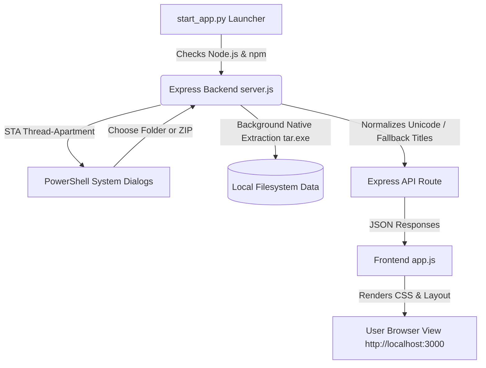

# 📸 Instagram Export Message Reader

A premium, local-first desktop-web application to read, explore, search, and manage your Instagram data exports. It is designed to run entirely on your local machine, supporting both standard **HTML (Standard)** and advanced **JSON (Advanced)** formats, unpacked directories, and direct **ZIP archives**.

---

## ✨ Features

### 📁 Advanced Archive Handling
- **Direct ZIP Extraction**: Upload your raw Instagram `.zip` export directly. The application handles dynamic extraction in the background to the same location, saving manual setup time.
- **Native Execution Integration**: Employs native operating system binaries (`tar.exe` on Windows) for maximum extraction speed and reliability.
- **Incremental Extraction**: Checks if the target ZIP is already extracted to skip redundant operations, optimized for massive archive files.

### 🎨 Premium Aesthetics & UX
- **Tailored CSS Dark Mode**: Built with premium CSS variable-based styling, smooth HSL gradient backgrounds, and refined typography (Google Fonts: Inter & Outfit).
- **Glassmorphism Design**: Elegant blur backdrops, soft card borders, and visually distinct interactive elements.
- **Responsive Layout**: Seamlessly transitions between desktop views (featuring dual-pane split chat controls) and mobile views (collapsible sidebars and overlays).
- **Active Selection & Bulk Actions**: Select multiple chats at once to batch delete them from the workspace view.

### 🔍 Search & Filtering
- **Workspace-wide Search**: Instantly filters your direct message index in real-time as you type, matching against participant names.
- **Conversation Search**: Scan through the entire transcript of any active chat window to locate specific keywords, messages, or media logs.

### 🔧 Robust Parsing & Emoji Fixes
- **Unicode Fixer**: Resolves Instagram's native JSON encoding bugs that display byte-escaped sequences (e.g. `\u00f0\u009f\u0098\u008a`) instead of original unicode characters/emojis.
- **Obfuscated Folder Fallback**: Correctly names obfuscated or numeric folder names (Instagram's default direct chat folder structure) by parsing participant files and extracting accurate sender metadata.
- **Media Chronology**: Embeds inline photo shares, video clips, and voice notes accurately within their corresponding text message bubbles.

### 🔒 Privacy & Offline Security
- **100% Local Processing**: No remote APIs, telemetry trackers, or external databases. Your private chat data never leaves your computer.
- **Safe Directory renaming**: Renaming chats updates folder indexes dynamically and writes localized custom names locally.

---

## 🛠️ System Architecture



---

## 🚀 Getting Started

### Prerequisites

1. **Node.js** (v18.0.0 or higher is recommended). [Download Node.js](https://nodejs.org/).
2. **Python 3** (used to run the automated installer and browser launcher).

### Installation & Launching

The application includes an automated launcher script (`start_app.py`) that manages dependency verification, initializes standard IO encoding streams, starts the local Express server, and pops the browser automatically.

1. Clone or download this project directory to your computer.
2. Open your shell or Command Prompt in the project folder.
3. Run the automated launcher:
   ```bash
   python start_app.py
   ```
4. The server will start and the main interface will open automatically in your browser at:
   [**http://localhost:3000**](http://localhost:3000)

---

## 📖 How to Request Your Instagram Data

To use this application, you must request your data export from Instagram:

1. Go to **Instagram Settings** -> **Your Activity** -> **Download Your Information**.
2. Select **Some of your information** and make sure to check **Messages**.
3. Choose your format:
   - **JSON format** (Advanced: captures detailed metadata, reactions, and voice notes).
   - **HTML format** (Standard: clean and easy to render).
4. Download the resulting ZIP file to your computer. You can upload this ZIP directly into the **Instagram Export Message Reader**.

---

## ⚙️ Configuration & Tech Stack

- **Frontend**: HTML5, Vanilla JavaScript, and Premium Modern CSS.
- **Backend**: Node.js, Express, File System (`fs`) API, Child Process (`child_process`).
- **Launcher**: Python 3 standard library.
- **System Bindings**: PowerShell STA OpenFileDialog/FolderBrowserDialog and standard native command utilities.

---

## ⚖️ License

Distributed under the MIT License. See [LICENSE](file:///E:/Vibe%20coding/instagram_chat_viewer/LICENSE) for more details.
